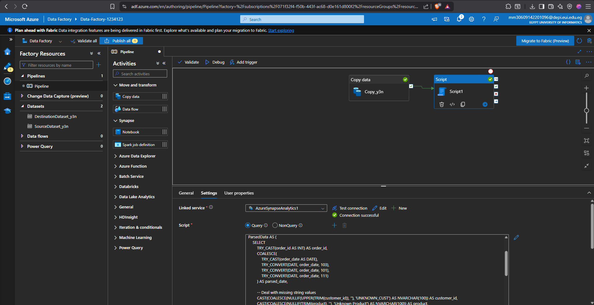
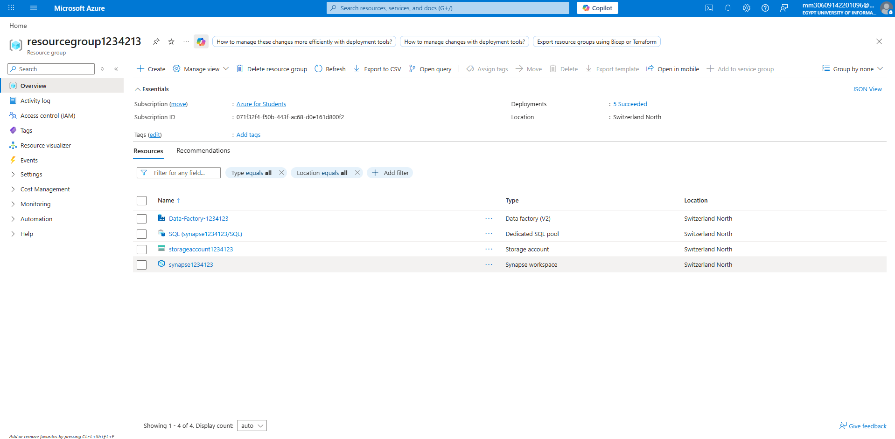
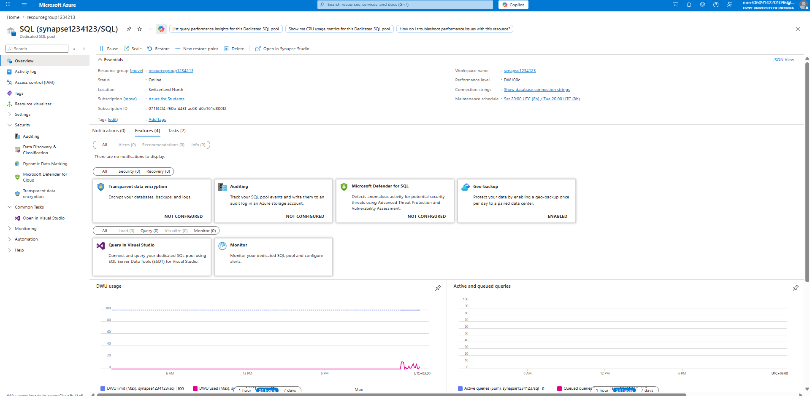

# 🚀 Azure Data Factory: E2E Sales Data Pipeline

This repository contains a complete ETL pipeline that ingests, cleans, and validates sales data using **Azure Data Factory** and **Azure Synapse Analytics**.

## 📁 Project Structure
- **`sql/`**: Contains the T-SQL transformation script for data cleaning.
- **`Images/`**: Screenshots of the ADF pipeline and results.
- **`sales.csv`**: The raw "dirty" dataset used for this project.

## 🛠️ Pipeline Overview
The pipeline consists of two main activities:
1. **Copy Activity**: Ingests the raw `sales.csv` from Azure Data Lake Gen2 into a staging table (`dbo.sales`).
2. **Script Activity**: Executes advanced cleaning logic to create a production-ready table (`dbo.sales_cleaned`).

## 🧹 Data Cleaning Logic
The SQL script (`clean_sales_data.sql`) handles the following real-world data issues:
- **Date Normalization**: Forward-filling (ffill) missing dates and handling multiple formats.
- **Math Validation**: Enforcing `Total = Quantity * Price` and fixing negative values.
- **Deduplication**: Removing duplicate orders using window functions.
- **Missing Values**: Standardizing null categories and customer IDs.

## 📊 Result
The final output is a clean, reliable dataset ready for Power BI reporting.

